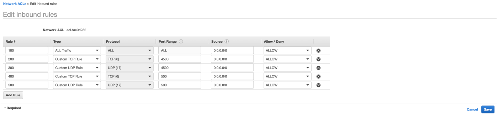

# Connect On Premise Networks to Oracle Cloud over IPSec

In this guide I have included some steps which will end user to perform below operations: 

- Create a IPSec VPN between Customer CPE and Oracle Cloud using Static Routes
- Update IPsec static route to BGP Dynamic Routing

## Setup Customer Premises Equipment on AWS Cloud


1. Create a VPC with correct Subnet:

   - Follow below steps to setup vPC on AWS Cloud.
   - Select desired AWS Region: US West 2 (For Example)
   - Creating a VPC with CIDR (Example: 172.31.0.0/16)
   - Create an Internet Gateway to support internet routes from this VPC
   - Attach Internet Gateway to VPC
   - Make Sure Route Table has default route to Internet through Internet Gateway

2. Create a CPE VM on AWS
   - Choose CentOS Image
   - Create VM in mentioned region and select correct key-pair to access it afterwards (t2.medium)
   - Make sure you can ping the VM or SSH if not select correct security groups with correct firewall configuration
   - Install libreswan package on your CPE VM
     ```
     sudo yum -y install libreswan
     ```
   - Make sure you Source/Destination Check is disabled if not already

    

   - Connect to CPE VM and Update file(/etc/sysctl.conf) with following content and apply update using (sudo sysctl -p) command:
     ```
     net.ipv4.ip_forward=1
     net.ipv4.conf.all.accept_redirects = 0
     net.ipv4.conf.all.send_redirects = 0
     net.ipv4.conf.default.send_redirects = 0
     net.ipv4.conf.eth0.send_redirects = 0
     net.ipv4.conf.default.accept_redirects = 0
     net.ipv4.conf.eth0.accept_redirects = 0
     ```
3. On your AWS VPC Network update route table enteries to reflect pointing to Oracle VCN network (172.0.0.0/16):

    

4. Update Security Rules for Security Group Policy (Source IP could be IPSec Endpoint) used for CPE VM to include IPSec tcp and udp ports:
    - Update Security Group Policies on AWS to Support IPSec Config
      
      

5. Update Network Policy to Reflect correct tcp and UDP ports of IPsec (In my case allow all should be okay) 

   

## Setup IPSec Required Config on Oracle Cloud

In this section we will include necessary steps to support Oracle Cloud configuration to support IPSec.

You need to select your region to support below configuration:

1. Setup Dynamic Routing Gateway (DRG) and Customer Premises Equipment:
   - Create DRG on Oracle Cloud

     

   - Create CPE libreswan instance on Oracle Cloud

     

   - Create Virtual Cloud Network (VCN) with required subnet

     

   - Attach VCN to DRG

     

2. Setup IPSec on Oracle Cloud

   - Create IPSec Connection from DRG (**Using Static Routing**)

     

   - Confirm IPSec Connection Configuration health 

     

3. Update Ingress Rules and Routes to connect AWS VPC and CPE

   - Add Ingress rules on VCN NCLs

     

   - Add Route to Route Table

     

## Configure CPE on AWS for IPSec  

This section includes required configuration which you need to collect from Oracle Cloud IPSec Connections and then use it on AWS CPE for setting up IPSec connections between AWS CPE and Oracle Cloud: 

Follow below steps accordingly: 

1. IPSec Configuration Parameters:
   - Collect required parameters to setup IPsec config on Liberswan VM:
   ```
   ${cpeLocalIP}: The IP address of your Libreswan device.
   ${cpePublicIpAddress}: The public IP address for Libreswan. This is the IP address of your outside interface. Depending on your network topology, the value might be different from ${cpeLocalIP}.
   ${oracleHeadend1}: For the first tunnel, the Oracle public IP endpoint obtained from the Oracle Console.
   ${oracleHeadend2}: For the second tunnel, the Oracle public IP endpoint obtained from the Oracle Console.
   ${vti1}: The name of the first VTI used. For example, vti1.
   ${vti2} : The name of the second VTI used. For example, vti2.
   ${sharedSecret1}: The pre-shared key for the first tunnel. You can use the default Oracle-provided pre-shared key, or provide your own when you set up the IPSec connection in the Oracle Console.
   ${sharedSecret2}: The pre-shared key for the second tunnel. You can use the default Oracle-provided pre-shared key, or provide your own when you set up the IPSec connection in the Oracle Console.
   ${vcnCidrNetwork}: The VCN IP range.
   ```
2. Update values and add below content in (/etc/ipsec.d/oci-ipsec.conf) file of CPE VM which you created on AWS Cloud:
   ```
   conn oracle-tunnel-1
        left=${cpeLocalIP}
        # leftid=${cpePublicIpAddress} # See preceding note about 1-1 NAT device
        right=${oracleHeadend1}
        authby=secret
        leftsubnet=0.0.0.0/0 
        rightsubnet=0.0.0.0/0
        auto=start
        mark=5/0xffffffff # Needs to be unique across all tunnels
        vti-interface=${vti1}
        vti-routing=no
        ikev2=no # To use IKEv2, change to ikev2=insist
        ike=aes_cbc256-sha2_384;modp1536
        phase2alg=aes_gcm256;modp1536
        encapsulation=yes
        ikelifetime=28800s
        salifetime=3600s
   conn oracle-tunnel-2
        left=${cpeLocalIP}
        # leftid=${cpePublicIpAddress} # See preceding note about 1-1 NAT device
        right=${oracleHeadend2}
        authby=secret
        leftsubnet=0.0.0.0/0
        rightsubnet=0.0.0.0/0
        auto=start
        mark=6/0xffffffff # Needs to be unique across all tunnels
        vti-interface=${vti2}
        vti-routing=no
        ikev2=no # To use IKEv2, change to ikev2=insist
        ike=aes_cbc256-sha2_384;modp1536
        phase2alg=aes_gcm256;modp1536
        encapsulation=yes
        ikelifetime=28800s
        salifetime=3600s
   ```
3. Add below secrets which you collected from Oracle Cloud IPSec Connection in this file (/etc/ipsec.d/oci-ipsec.secrets)
  ```
  ${cpePublicIpAddress} ${ipAddress1}: PSK '${sharedSecret1}'
  ${cpePublicIpAddress} ${ipAddress2}: PSK '${sharedSecret2}'
  ```

  > Note: here ipAddress1 and ipAddress2 are IPSec orackeHead1 and oracleHead2. 
  > Note: Make sure you pass sharedSecret in single quote. 

4. Restart ipsec service using below command:
   ```
   service ipsec restart
   ```
5. Check IPsec interfaces came online using `ip link show` and you should see `vti1` and `vti2` interfaces there.

   > Note: This step should be fullfilled before proceeding if its failing please follow official troubleshooting steps of IPsec on Oracle Cloud
   
6. Create routes for Oracle Cloud VCN network using IPSec tunnel interfaces on CPE VM:
   ```
   ip route add 172.0.0.0/16 nexthop dev vti1 nexthop dev vti2
   ip route show
   ```
7. Verify IPSec status using `ipsec status` and you should see something like this below:
   ```
   000 #1: "oracle-tunnel-1":4500 STATE_MAIN_I4 (ISAKMP SA established); EVENT_SA_REPLACE in 27667s; lastdpd=-1s(seq in:0 out:0); idle; import:admin initiate
   000 #3: "oracle-tunnel-1":4500 STATE_QUICK_I2 (sent QI2, IPsec SA established); EVENT_SA_REPLACE in 2498s; isakmp#1; idle; import:admin initiate
   000 #3: "oracle-tunnel-1" esp.4ce21b0d@140.204.60.38 esp.d91f4041@172.31.31.135 tun.0@140.204.60.38 tun.0@172.31.31.135 ref=0 refhim=0 Traffic: ESPin=0B ESPout=0B! ESPmax=4194303B
   000 #7: "oracle-tunnel-1":4500 STATE_MAIN_R3 (sent MR3, ISAKMP SA established); EVENT_SA_REPLACE in 28397s; newest ISAKMP; lastdpd=0s(seq in:0 out:0); idle; import:not set
   000 #8: "oracle-tunnel-1":4500 STATE_QUICK_R2 (IPsec SA established); EVENT_SA_REPLACE in 3197s; newest IPSEC; eroute owner; isakmp#7; idle; import:not set
   000 #8: "oracle-tunnel-1" esp.3ecfc7a3@140.204.60.38 esp.cb92ec6b@172.31.31.135 tun.0@140.204.60.38 tun.0@172.31.31.135 ref=0 refhim=0 Traffic: ESPin=0B ESPout=0B! ESPmax=4194303B
   000 #2: "oracle-tunnel-2":4500 STATE_MAIN_I4 (ISAKMP SA established); EVENT_SA_REPLACE in 27908s; lastdpd=-1s(seq in:0 out:0); idle; import:admin initiate
   000 #4: "oracle-tunnel-2":4500 STATE_QUICK_I2 (sent QI2, IPsec SA established); EVENT_SA_REPLACE in 2489s; isakmp#2; idle; import:admin initiate
   000 #4: "oracle-tunnel-2" esp.7dcd143b@140.204.60.44 esp.34dc4f28@172.31.31.135 tun.0@140.204.60.44 tun.0@172.31.31.135 ref=0 refhim=0 Traffic: ESPin=0B ESPout=0B! ESPmax=4194303B
   000 #5: "oracle-tunnel-2":4500 STATE_MAIN_R3 (sent MR3, ISAKMP SA established); EVENT_SA_REPLACE in 28395s; newest ISAKMP; lastdpd=2s(seq in:0 out:0); idle; import:not set
   000 #6: "oracle-tunnel-2":4500 STATE_QUICK_R2 (IPsec SA established); EVENT_SA_REPLACE in 3195s; newest IPSEC; eroute owner; isakmp#5; idle; import:not set
   000 #6: "oracle-tunnel-2" esp.b4aee655@140.204.60.44 esp.f5076f1c@172.31.31.135 tun.0@140.204.60.44 tun.0@172.31.31.135 ref=0 refhim=0 Traffic: ESPin=0B ESPout=0B! ESPmax=4194303B
   ```
8. Verify IPSec connection status on Oracle Cloud:

     

9. Verify IPsec interfaces status on CPE VM:
   ```
   [root@ip-172–31–31–135 centos]# ip link show
   1: lo: <LOOPBACK,UP,LOWER_UP> mtu 65536 qdisc noqueue state UNKNOWN mode DEFAULT group default qlen 1000
    link/loopback 00:00:00:00:00:00 brd 00:00:00:00:00:00
   2: eth0: <BROADCAST,MULTICAST,UP,LOWER_UP> mtu 9001 qdisc mq state UP mode DEFAULT group default qlen 1000
    link/ether 02:16:8a:f7:a3:cd brd ff:ff:ff:ff:ff:ff
   3: ip_vti0@NONE: <NOARP> mtu 1480 qdisc noop state DOWN mode DEFAULT group default qlen 1000
    link/ipip 0.0.0.0 brd 0.0.0.0
   4: vti1@NONE: <POINTOPOINT,NOARP,UP,LOWER_UP> mtu 8981 qdisc noqueue state UNKNOWN mode DEFAULT group default qlen 1000
    link/ipip 172.31.31.135 peer 140.204.60.38
   5: vti2@NONE: <POINTOPOINT,NOARP,UP,LOWER_UP> mtu 8981 qdisc noqueue state UNKNOWN mode DEFAULT group default qlen 1000
    link/ipip 172.31.31.135 peer 140.204.60.44
   ```

## Setup IPSec with Dynamic Routing (BGP) on Oracle Cloud

In this section we will update routing from static to dynamic and update our configuration on Oracle Cloud and CPE VM. We will use `quagga` package to create required bgp setup on CPE.

You need to follow below steps: 

1. Install required quagga package to support BGP configuration on CPE VM using below command:
   ```
   yum install quagga -y 
   ```
2. Update vnet interfaces addresses used to setup IPSec configuration:
   ```
   leftvti=10.10.10.1/30
   leftvti=10.10.10.5/30
   ```
   - You will need to add one line from above in each IPSec tunnel configuration which you created here (/etc/ipsec.d/oci-ipsec.conf) on CPE VM.
   - Example: 
   ```
   conn oracle-tunnel-1
        left=${cpeLocalIP}
        # leftid=${cpePublicIpAddress} # See preceding note about 1-1 NAT device
        right=${oracleHeadend1}
        authby=secret
        leftsubnet=0.0.0.0/0 
        rightsubnet=0.0.0.0/0
        auto=start
        mark=5/0xffffffff # Needs to be unique across all tunnels
        vti-interface=${vti1}
        vti-routing=no
        ikev2=no # To use IKEv2, change to ikev2=insist
        ike=aes_cbc256-sha2_384;modp1536
        phase2alg=aes_gcm256;modp1536
        encapsulation=yes
        leftvti=10.10.10.1/30
        ikelifetime=28800s
        salifetime=3600s
   conn oracle-tunnel-2
        left=${cpeLocalIP}
        # leftid=${cpePublicIpAddress} # See preceding note about 1-1 NAT device
        right=${oracleHeadend2}
        authby=secret
        leftsubnet=0.0.0.0/0
        rightsubnet=0.0.0.0/0
        auto=start
        mark=6/0xffffffff # Needs to be unique across all tunnels
        vti-interface=${vti2}
        vti-routing=no
        ikev2=no # To use IKEv2, change to ikev2=insist
        ike=aes_cbc256-sha2_384;modp1536
        phase2alg=aes_gcm256;modp1536
        leftvti=10.10.10.5/30
        encapsulation=yes
        ikelifetime=28800s
        salifetime=3600s
   ```
   - If you plan to use different network/subnet for BGP routing you can update interfaces IPs accordingly. 

3. Update zebra configuration (/etc/quagga/zebra.conf) on CPE VM with below content: 
   - I am advertising my VPC subnet `172.31.16.0/20` but if your subnet is different you can update it accordingly:
   ```
   !
   ! Zebra configuration saved from vty
   !   10/08/2020 13:18:58
   !
   hostname <hostname>
   password zebra
   enable password zebra
   log file /var/log/quagga/quagga.log
   !
   interface ens3
    ipv6 nd suppress-ra
   !
   interface ens5
    ipv6 nd suppress-ra
   !
   interface ip_vti0
    ipv6 nd suppress-ra
   !
   interface lo
   !
   interface vti1
    ip address 10.10.10.1/30
    ipv6 nd suppress-ra
   !
   interface vti2
    ip address 10.10.10.5/30
    ipv6 nd suppress-ra
   !
   ip route 172.31.16.0/20 vti1
   ip route 172.31.16.0/20 vti2
   !
   ip forwarding
   !
   !
   line vty
   !
   ```
4. Create BGP configuration to support dynamic routing over IPSec on CPE VM : (ebgp configuration) 
   - Update this file (/etc/quagga/bgpd.conf) on CPE VM
   - Update hostname as you need 
   - We are using EBGP and AS 64555 which you will need to use on Oracle Cloud IPSec Connection
   ```
   hostname <hostname>
   password zebra
   enable password zebra1
   router bgp 64555
    bgp router-id 10.10.10.1
     network 10.10.10.0/30
     network 10.10.10.4/30
     network 172.31.16.0/20
     neighbor 10.10.10.2 remote-as 31898
     neighbor 10.10.10.2 ebgp-multihop 255
     neighbor 10.10.10.2 next-hop-self
     neighbor 10.10.10.6 remote-as 31898
     neighbor 10.10.10.6 ebgp-multihop 255
     neighbor 10.10.10.6 next-hop-self


   log file bgpd.log
   log stdout
   ```
5. Start services to support this use case and enable them using below command:
   ```
   systemctl start zebra && systemctl enable zebra && systemctl start bgpd && systemctl enable bgpd
   Start ipsec service
   ```
6. Restart IPSec on CPE VM using below command:
   ```
   service ipsec restart
   ```

### Update IPsec Connections on Oracle Cloud to Use BGP as Dynamic Routing

In this section we will update IPSec Connection Configuration on Oracle Cloud: 

1. Update IPSec Connection 1 Configuration as below: 

     

2. Update IPSec Connection 2 Configuration as below: 
   - You will have to wait until step 1 provisioning is compelte if you are using UI

     

### Validation of IPSec BGP between Oracle Cloud and CPE 

In this section we will validate IPSec over BGP health status: 

1. Validate BGP IPSec health status on Oracle Cloud IPSec Connection and it should look like as below:

     

2. Connect to CPE VM and see bgp summary 
   ```
   [root@ip-172–31–31–135 quagga]# vtysh
   Hello, this is Quagga (version 0.99.22.4).
   Copyright 1996–2005 Kunihiro Ishiguro, et al.
   ip-172–31–31–135.us-west-2.compute.internal# sh ip bgp sum
   BGP router identifier 10.10.10.1, local AS number 64555
   RIB entries 9, using 1008 bytes of memory
   Peers 2, using 9120 bytes of memory
   Neighbor V AS MsgRcvd MsgSent TblVer InQ OutQ Up/Down State/PfxRcd
   10.10.10.2 4 31898 4 11 0 0 0 00:00:19 1
   10.10.10.6 4 31898 5 11 0 0 0 00:00:15 1
   Total number of neighbors 2
   ip-172–31–31–135.us-west-2.compute.internal# sh ip bgp
   BGP table version is 0, local router ID is 10.10.10.1
   Status codes: s suppressed, d damped, h history, * valid, > best, i - internal,
    r RIB-failure, S Stale, R Removed
   Origin codes: i - IGP, e - EGP, ? - incomplete
   Network Next Hop Metric LocPrf Weight Path
   *> 10.10.10.0/30 0.0.0.0 0 32768 i
   *> 10.10.10.4/30 0.0.0.0 0 32768 i
   * 172.0.1.0/24 10.10.10.6 0 31898 i
   *> 10.10.10.2 0 31898 i
   *> 172.31.16.0/20 0.0.0.0 0 32768 i
   *> 192.168.12.0 0.0.0.0 0 32768 i
   Total number of prefixes 5
   ip-172–31–31–135.us-west-2.compute.internal# exit
   [root@ip-172–31–31–135 quagga]#
   ```
3. Add subnets on either side of BGP or VCN networks and you should see routes are populated dynamically. 

# Conclusion 

This concludes our IPSec configuration using static and dynamic routing on Oracle Cloud.