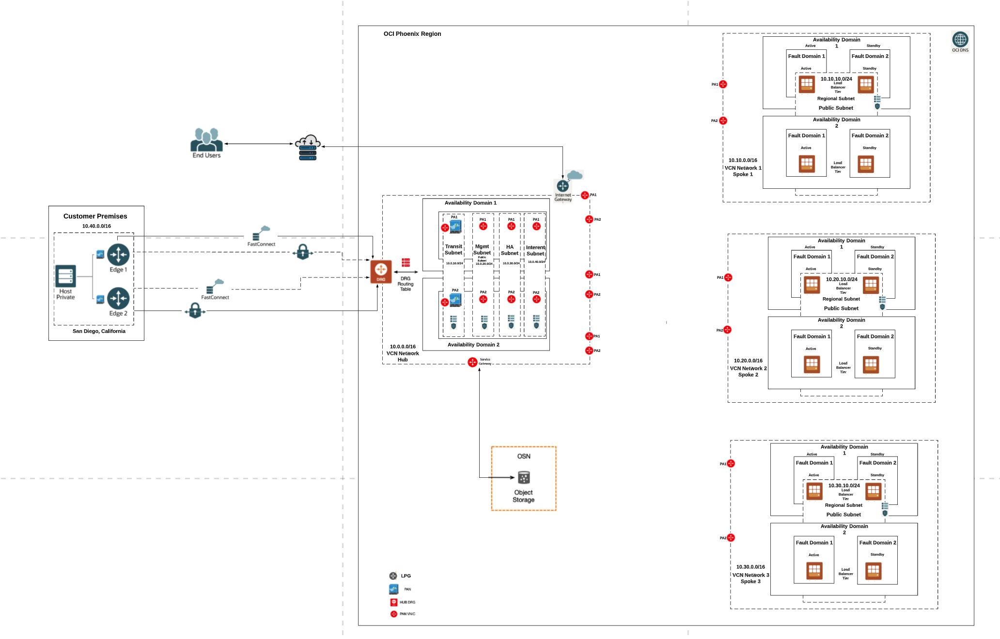

# Oracle Cloud and PANW VM Series Firewall Network Design 

I have created this document to include a possible design diagram as per below use case: 

> Note: There might be some changes in this document but I am happy to include them as needed. 


## Use Case Details 

A customer has below requirements: 

```
- They have an on-premise location based in San Diego, California
- They are using Oracle cloud in Phoenix, Arizona
	        * Their application can not tolerate high jitter, or high latency.
- They can not tolerate any downtime.
- They are interested in using both IPSEC VPN, and FastConnect.
- The customer also has three (3) different Lines of Business (i.e. Finance, Engineering, and Marketing) which all require their own Virtual Cloud Network for isolation and security purposes.
- The customer would like to have a network virtual appliance deployed in Oracle Cloud from their favorite vendor, to inspect all traffic traversing from On-premise to Cloud, and the 3 different Lines of Business. 
```

- Diagram: 




> Note: I can go with Linear Peering Gateway (LPG) between Spoke and Hub VCN and lower number of VNIC interfaces for Palo Alto VM Series Firewall. 

# Feedback

Feedbacks are welcome and you can open issues too.